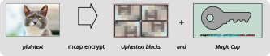
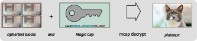
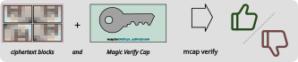

* Magic Cap

Magic Cap turns the problem of having a lot of secret data (e.g. =enjoyable-movie.mp4=) into the problem of having only a small amount of secret data.

The resulting (fixed, tiny) Magic Cap string can combined with the data file for the secret data; either part by itself cannot learn the secret data.

The "Magic Cap" string is short (70 bytes) and can fit in TPMs or other secure storage.
Any interesting uses come when thinking about separating the Data (ciphertext + metadata) from the Magic Cap in time or space or both.

NOTE: this is a brand new project with no cryptographic review.
We are definitely interested in your use-cases and ideas, but please ask your cryptographer before deploying to production!

#+CAPTION: Depiction of 'mcap decrypt' visualizing the resulting data + Magic Cap
#+NAME:   fig:encrypt

* Using This Crate

Rust programmers can use the Rust APIs directly.
Humans use the CLI.

The CLI uses subcommands.
We explore the basics before explaining what they mean.

Encrypt "README.org" into: 1) a file containing ciphertext (and metadata) and 2) a Magic Cap string:
#+name: encrypt
#+begin_src bash :results output
cargo run -- encrypt --plaintext README.org ciphertext
#+end_src

#+RESULTS: encrypt
: mcap0rn36cf_726tzxsj55BDdJuD0FqFeLNvUvnYWti8MYCDtq6FVZ31ERUdXgk76uimTM

Now, we have two things: "a Data File" and "a Magic Cap string".
The latter is =mcap0r<base64-encoded data>=

Before we break that down, lets convert the DataFile + Magic Cap string back into this README!

#+begin_src bash :results output :var MCAP=encrypt
  cargo run -- decrypt --ciphertext ciphertext --cap ${MCAP} --plaintext plain
#+end_src

#+RESULTS:
: Wrote 10375 bytes of plaintext to "plain".

We can confirm that they're the same:
#+begin_src bash :results output
diff -s README.org plain

#+end_src

#+RESULTS:
: Files README.org and plain are identical

* Practical Examples

Let's say you're a graphic designer and your client wants to see this month's proofs for their secret upcoming ad campaign.
You can encrypt the proofs with magic-cap and upload the encrypted file somewhere, and then send a single line of ~70 characters to your client so they can decrypt the proofs on their computer.

One advantage here is that the "somewhere" you put the bulk data _cannot_ decrypt unless you also share the "magic cap" string with them.

If you were to store these large files on google docs, google cannot see the contents to use for their AI training, so your client's ad campaign doesn't get exposed.

If your client asks you to upload their proofs to an Amazon S3 bucket, and they leave that bucket world readable, their data is still not exposed!

Magic Cap features:
- the data is always encrypted (unlike a zip file that _can_ have a password, but might not!)
- the data and the Magic Cap string are communicated separately (this could be later in time too)
- no network / server interaction is required to share a Magic Cap string -- unlike your new dishwasher, uploading and later decrypting (or sharing) of a Magic Cap does not require the participation of a large tech company. (If =us-east-1= is down, you can still do operations on your data).

Additional features developers may enjoy:
- a "Verify Cap" gives the holder *only* the ability to confirm the ciphertext is valid -- the holder of a Verify Cap still cannot decrypt it or see any of the plaintext.
- a corresponding "Verify Cap" may be derived offline by anyone holding a "Magic Cap" string.

* Bonus awesome for reading this tutorial / readme.

Inside this same folder is "kitten.mcap".
The mcap to unlock it is: =mcap0r-Gshm9tyvjXDnfWpLWKMgjcK0AOdC-O12vvLW5rxeV7752pj2a2uogG4RpvMFS0g=
If you're using "cargo" a command-line to do that is:

#+begin_src sh
  cargo run -- decrypt --ciphertext kitten.mcap --cap mcap0r-Gshm9tyvjXDnfWpLWKMgjcK0AOdC-O12vvLW5rxeV7752pj2a2uogG4RpvMFS0g --plaintext kitten.jpeg
#+end_src

#+RESULTS:
: kitten.jpeg

We have found an amazing cat picture from a public domain source[fn:1] for your viewing pleasure.
You could also verify that the ciphertext is correct if you only had the "verify" version of the cap:

#+begin_src sh
  cargo run -- verify --ciphertext kitten.mcap --cap mcap0v-Gshm9tyvjXDnfWpLWKMgjcK0AOdC-O12vvLW5rxeV4
#+end_src

#+RESULTS:

* Breaking These Down Together

The first example in the "Using this Crate" section does the encryption -- it turns your plaintext into two things:
- A single Data File containing metadata and all the ciphertext blocks
- The Magic Cap string, 70 characters starting with =mcap0r...=

The Data File reveals that there exists a file of a particular length, but nothing about its contents.
You could upload this to a commercial file service, to shared storage, a removable drive, whatever -- only when the Magic Cap and the corresponding Data File are re-united can the plaintext be recovered.

In fact, that is the next step in the example!

Running =mcap decrypt= takes the Data File and the Magic Cap and produces a copy of the original plaintext file.
Presenting a different Magic Cap will not work.

#+CAPTION: Depiction of combing a Magic Cap and corresponding Data File to produce the original
#+NAME: fig:decrypt

It's also possible to turn the Magic Cap into a less-powerful Magic Verify Cap which can only confirm that the ciphertext is correct.
This "Verify Cap" lacks the secret needed to decrypt the ciphertext.
Anyone can turn a Magic Cap into a Verify Cap (without having to interact with a server or anyone else).
Astute readers may have already noticed that a Verify Cap is just a Magic Cap without the last =:=-separated field.

#+CAPTION: Depiction of verifying ciphertext with a Magic Verify Cap (but can't see plaintext)
#+NAME: fig:verify

This unrestricted sharing is an important features of Magic Caps: users (or software written on their behalf) are empowered to make their own decisions.

* Contents of a Magic Cap

The actual Magic Cap string is fairly straightforward.
There are several fields, delimited by colons.
The first two are a static "mcap" identifier, and the version (currently only "0").

The remaining two fields are URL-safe Base64 encoded bytes.

#+CAPTION: Contents of the various fields of a Magic Cap
#+NAME: fig:magic-cap
[[./diagrams/mcap-contents.svg]]

One field is the hash of the "metadata" portion of the Data File -- this allows the software to confirm that a particular Magic Cap corresponds to the Data File.
There is a Merkle Tree over the ciphertext blocks included in the metadata, which can also be checked (and may be useful for random-access or streaming use-cases where only some blocks of ciphertext are immediately available).

The final field is the random, secret symmetric key that encrypts the data.
Thus the entire Magic Cap is a secret.

Without the final field, we have a "Magic Verify Cap" that may only confirm that a particular Data File is in fact complete and corresponds to the Magic Verify Cap.
Of course, lacking the secret key, the holder of such a Cap cannot see any of the plaintext

* Summary of Features

To summarize what we get from Magic Cap as it exists right now:

- turn plaintext into two things:
    - a file, containing serialized metadata and ciphertext blocks
    - a Magic Cap string
- turn a Magic Cap string and the serialized metadata + ciphertext back into plaintext
- take any Magic Cap string and turn it into a Verify Cap string
- use a Verify Cap string to confirm an associated file contains well-formed metadata and ciphertext

Users can do anything they like with this data and the Magic Cap or Verify Cap.
They can upload the data to any service, share it via USB thumb drives, whatever.
Users can also choose to distribute the Magic Cap (or less powerful Verify Cap) as they see fit.

None of this depends on any service or network interactions.

We are excited to see the practical uses of this!
While we definitely have more features to layer on top, we believe this is already useful.

* Where From and Where To

Magic Cap exists as an attempt to distill the most interesting and basic feature from Tahoe-LAFS.
While that system does many other things besides, it also forces you to use "the whole thing" (including a long-running daemon).
We are attempting a more layered approach.

We haven't written a formal roadmap (yet!) -- but we do plan on pulling further inspiration from Tahoe-LAFS, modernizing the cryptography, combining aspects of Magic Wormhole, enabling proper (memory-limited) random-access and streaming, and network APIs and use-cases.

In the Tahoe-LAFS system, mutables suffered from a few issues -- a huge one being that _users_ had to enforce that only a single computer could write to them.
We are *not* going to ignore mutable Caps and are exploring several designs without the "single writer" limitation.

Stay tuned, get in touch!

* Cool ways we've thought of to use this nifty thing

- Border Crossing app
  You don't want DHS to unlock your phone and read what you really think of the political situation.
  You encrypt the data, send the mcap off to your friend, and delete the originals.
- Release a game or music without flooding the server.
  You've finished your amazing album, people want to download it from your website days before the "official" release.
  You encrypt the album with Magic Cap, fans can download the album whenever they want.
  You release the mcap on mastodon where all your fans are following you anyway.
  They have instant access.
- Privacy from the Vendor
  This also works for large game downloads, STL files for 3D printing, etc.
  For example, you could sell your 3D designs for mounting chainsaws on a roomba without the vendor having access to them.

* Developer Notes

This repository was originally developed by @shapr and @meejah in a private JuJutSu based repo, the history from which is now squashed into this co-located JJ/Git hybrid workspace.

We welcome contributions from both Git and JJ users.

* Footnotes

[fn:1] https://www.loc.gov/free-to-use/cats/
