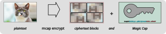
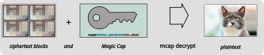

# Magic Cap Overview

Storage is boring.

We aim to keep it that way.
Magic Cap keeps data encrypted giving you simple tools to control access.

No accounts, no identities, store user data on untrusted providers.

Written in Rust, we provide libraries to read and write data from various sources and a command-line tool for experimentation.

> [!CAUTION]
> This is a release-early library that has **not yet received cryptographic (or other) audits**.
> We do appreciate feedback, but you own both pieces if you deploy to production :)

We can ignore most details and look at the high-level view of this tool as two diagrams.
Encrypting:



Decrypting:




## Capabilities *(not Accounts)*

Plaintext is transformed into an encrypted Data and a corresponding Read Cap.
A Read Cap may be transformed (offline) into a Verify Cap.
The size of the Data is a few percent larger than the plaintext.
Read and Verify Caps look like this:

```
mcap0r3LsgJf1LYZtRc_BGOzhx8j_FVDmFROmoBhDHGNTfXq8EAnU9NkykdwXfOg6VdQ7v
mcap0v3LsgJf1LYZtRc_BGOzhx8j_FVDmFROmoBhDHGNTfXq8
```

Anyone with both a Read Cap and the corresponding Data can turn it back into the plaintext.

Anyone with both a Verify Cap and the corresponding Data can confirm the ciphertext is correct and well-formed (but cannot see the plaintext)

This allows many use-cases, facilitating direct peer interactions since no server interaction is needed to create, transform or share Read Caps (or Verify Caps).

Magic Cap is inspired by the core ideas of "capability theory" embedded in Tahoe-LAFS.

Where and how the Data is stored, moved or transmitted is up to the application.
Similarly, where and how the Read Cap is kept is up to the application -- its small size allows for storage in TPM or other secure storage or even printed out or transcribed hard-copy.

This gives users of this library a lot of choice, while keeping the core concepts straightforware to reason about.


## Use Case Examples

Note that these are ideas about how this technology might be used.

We haven't built these applications, and highly recommend developing your own security model.


### Traditional App

Lots of application need to store user data.
A common pattern is to host the data on servers the application operators or developers control (e.g. Amazon S3).

Traditionally, these same developers have access to all of this data.

Using Magic Caps allows this user data to be truly private to the user -- the "Data" piece is stored on the servers, while the Read Cap is stored on user-controlled secure storage (e.g. the TPM of a smartphone or an encrypted hard-drive of a laptop).

(Read about "Verify Caps" that allow the service to confirm data integrity without having access to the plaintext).


### Timed Release of Large Digital Artifact (game, movie)

You have a multi-gigabyte digital artifact to release at a particular time.

Using Magic Caps, you can do this:

1. Encrypt the artifact, producing the large Data file and small Immutable Read Cap string
1. Upload the large Data file to any storage system you like (Web server, Torrent)
1. Instruct fans or users to download the Data

Then, when the actual release time arrives, you distribute the Read Cap string (via email, text, SMS, Signal, a Web site update).

This separates the distribution from the actual "release", reducing server bandwidth requirements, etc.


### Shared Organizational Data

An organazation often has lots of data, often with different visibility requirements.

A system centered around Magic Caps (along with the Catalog and Anthology concepts) could allow members of the organization to carry offline copies of all the data while only allowing access to particular pieces of it.

While Magic Cap itself has no concept of identity or users, application developers may layer this on top.

So, members of an organzation could all have a complete copy of all organization Data items (and keep in sync periodically via rsync or similar).

Since all these Data items are encrypted, members need a Read Cap to actually decrypt any of them.
Thus, particular members could be given Read Caps as they require them.
(Using the Anthology concept makes it easier to share many items with one Read Cap instead of many).


## Next Steps

This tool can be used via the available CLI, which exposes **most** of the Rust library functionality.

In the next sections, we explore more of the details and how to access them via the CLI.
