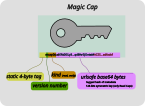
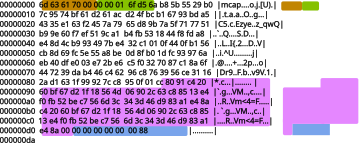

# Serialization Format

## Magic Cap Strings

Looking at the anatomy of a Magic Cap string.
Here is a Verify Cap:

The front bit is a static tag, version and format: `mcap0r` means a Magic Cap version 0 "Read Cap.
Following that is Web-safe Base64-encoded data.
The amount and interpretation of the data is specific to the Magic Cap kind and version.

For version 0, we have:

Verify Cap
  : Contains a 32-byte hash, wrapping up the metadata which includes the Merkle root of all the ciphertext blocks
  
Read Cap
  : Contains the same 32-byte hash as the Verify Cap, plus a 16-byte symmetric key used to decrypt the ciphertext.

The Read Cap is a secret: it contains a secret key.
Anyone holding it may decrypt the corresponding Data, assuming they can locate it.

To aid in location, a Verify Cap or Read Cap may be converted to an "Identifier" (which is a tagged hash of the 32-byte hash containted in the caps).
Thus, this Identifier does not reveal which Read or Verify Cap it "comes from" and serves as a unique id for storage servers (see also the [Network API](./network-api.md) and [Catalog](./catalog-anthology.md)).

## On Disc Format

A serialization of Magic Cap Data to disk looks like this.

Highlighted in brown is the static "mcap" tag bytes, followed by 4 bytes of unsigned int (u32) represending the version (which is "1" the only existing version).

Next, we look at the blue highlighted data and the **end** of the file -- the last 8 bytes.
This is a u64 telling us the offset where the metadata begins.
The metadata is all the bytes from this offset to the begining of the offset.

In this diagram, the metadata is highlighted in purple.
The remainder of the file is ciphertext blocks.

In the network API, the metdata is delivered by one endpoint, and the ciphertext by another.
Regardless, the metadata is encoded the same way on-disk an in the network API.

### Metadata Encoding

TODO
